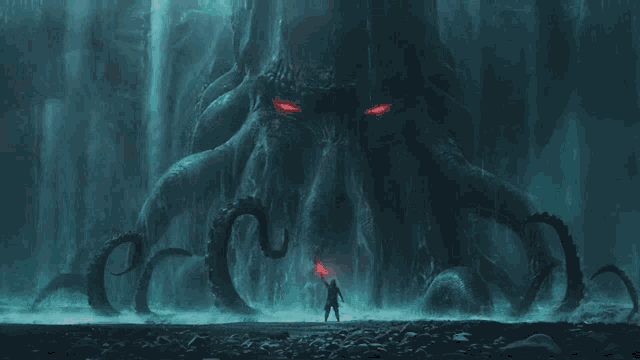

<!-- Animated Header -->

  

  "In the midst of the oceans, there are a lot of unknowns, and thus I will remain in my slumber till my calling."

---

## 💫 **About Me**  
🚀 Actively coding new websites and experimenting with all kinds of **microcontrollers**!  
<h1 align="center"> 
  
</h1>

---

## 🌐 **Socials**  

  
  
  
  
  
  

---

## 💻 **Tech Stack**

  

---

## 📊 **GitHub Stats**

   
  
   
  

---

## 🏆 **GitHub Trophies**

  

---

## 🔝 **Top Contributed Repos**

  

---

## ✍️ **Random Dev Quote**

  

---

## 🔥 **Profile Views**

  

---

_**Proudly created with [GPRM](https://gprm.itsvg.in) 🚀**_
